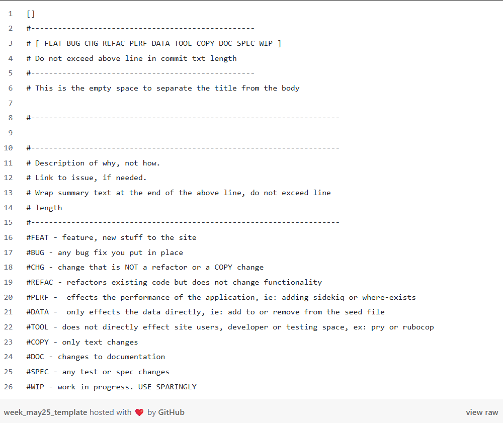

# Project Euler Commit Guide  
Multi-language Euler implementations with added functionality. 

## Commit Structure  
```
<type>(problem-<ID>/<lang>): <imperative verb> [pattern: <Pattern>]
```



## Commit Types  
| Type       | Use Case                                | Example Scope         |  
|------------|-----------------------------------------|-----------------------|  
| `[ FEAT ]`     | feature, new stuff      | `problem-001/rust`    |  
| `[ BUG ]`      | Bug correction                          | `problem-002/java`    |  
| `[ DOC ]`     | Documentation updates                   | `problem-000/project` |  
| `[ REFAC ]` | Code improvement                        | `problem-005/haskell` |  
| `[ SPEC ]`     | Add/update tests                        | `problem-014/python`  |  
| `[ PERF ]`     | Performance optimization                | `problem-031/clojure` |  


